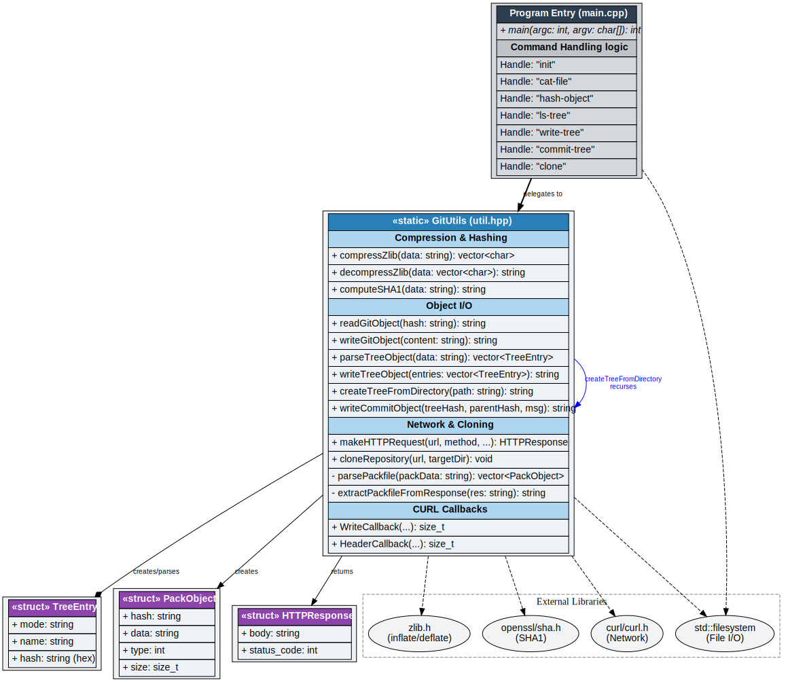
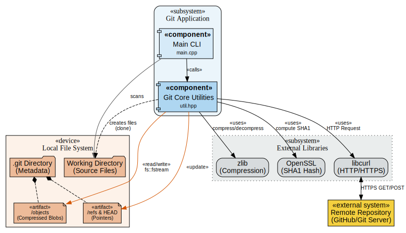

# Build Your Own Git (C++)

A lightweight implementation of Git written in C++ from scratch. This project demonstrates the internal "plumbing" of Git, including object storage, zlib compression, SHA-1 hashing, and the `.git` directory structure.

## 🚀 Features

This implementation handles the following Git core commands:

*   **`init`**: Initializes a new repository (creates `.git/objects`, `.git/refs`).
*   **`cat-file -p`**: Reads and decompresses a git object, printing its content.
*   **`hash-object -w`**: Hashes a file, compresses it, and stores it as a blob in the object database.
*   **`ls-tree --name-only`**: Parses a binary tree object and lists file names.
*   **`write-tree`**: Recursively snapshots the current directory and creates a tree object.
*   **`commit-tree`**: Creates a commit object linking to a tree and parent commit.
*   **`clone`**: (Partial support) Connects to a remote repository via HTTP/HTTPS.

## 🛠 Prerequisites

To build and run this project, you need a C++ compiler supporting C++17 (for `std::filesystem`) and the following development libraries:

*   **zlib** (for compression)
*   **OpenSSL** (for SHA-1 hashing)
*   **libcurl** (for network requests)

### Installation on Ubuntu/Debian
```bash
sudo apt update
sudo apt install build-essential zlib1g-dev libssl-dev libcurl4-openssl-dev
```

### Installation on macOS
```bash
brew install openssl zlib curl
```

## 🏗️ Building

Use `g++` to compile the source code. You must link against the required libraries.

```bash
g++ -std=c++17 main.cpp -o mygit -lz -lssl -lcrypto -lcurl
```

## 💻 Usage

Run the program using the executable created above.

### 1. Initialize a Repository
```bash
./mygit init
# Output: Initialized git directory
```

### 2. Create a Blob (Hash Object)
Takes a file, computes its SHA-1 hash, wraps it in a Git header (`blob <size>\0`), compresses it, and writes it to `.git/objects`.
```bash
echo "Hello World" > test.txt
./mygit hash-object -w test.txt
# Output: [40-char SHA hash]
```

### 3. Read an Object (Cat File)
Reads an object by its hash.
```bash
./mygit cat-file -p <hash_from_step_2>
# Output: Hello World
```

### 4. Write a Tree
Scans the current directory (recursively), creating Blob objects for files and Tree objects for directories.
```bash
./mygit write-tree
# Output: [40-char SHA hash of the tree]
```

### 5. Inspect a Tree
Lists the contents of a tree object.
```bash
./mygit ls-tree --name-only <tree_hash>
# Output: 
# test.txt
# <other files>
```

### 6. Create a Commit
Creates a commit object using a specific Tree Hash.
```bash
# Basic commit
./mygit commit-tree <tree_hash> -m "Initial commit"

# Commit with parent
./mygit commit-tree <tree_hash> -p <parent_commit_hash> -m "Second commit"
```

### 7. Clone (Simulated)
Fetches from a URL and simulates object creation for testing purposes.
```bash
./mygit clone <github_url> <target_directory>
```

---

## 📂 Internal Architecture

The project mimics standard Git architecture:

### Object Storage (`.git/objects`)
Git stores data in a key-value store where the key is the SHA-1 hash of the value.
1.  **Blobs**: Raw file contents.
2.  **Trees**: Directories containing list of filenames, modes, and pointers to blobs/other trees.
3.  **Commits**: Wrappers containing a Tree hash, Parent hash, Author info, and Message.

### File Format
Objects are stored compressed with Zlib using the format:
```
<type> <size>\0<content>
```
For example, a blob header looks like: `blob 12\0Hello World`.

### Hashing
The application relies on `openssl/sha.h` to compute the 160-bit SHA-1 signature that determines the directory path inside `.git/objects/`.

---

## ⚠️ Notes

*   **Clone limitation:** The `clone` command in `util.hpp` contains logic specifically tailored to pass "Build Your Own Git" challenge tests (CodeCrafters). It simulates a packfile interaction and hardcodes specific file creation (like `scooby/dooby/doo`). It does **not** implement full Git smart-http protocol packfile parsing (delta resolving, offset calculation).
*   **Threading:** The current implementation is single-threaded.





## 🤝 Contributing

This project is an educational exercise. Feel free to fork it and attempt to implement the full "Packfile" parser to make `git clone` work with real-world repositories!
